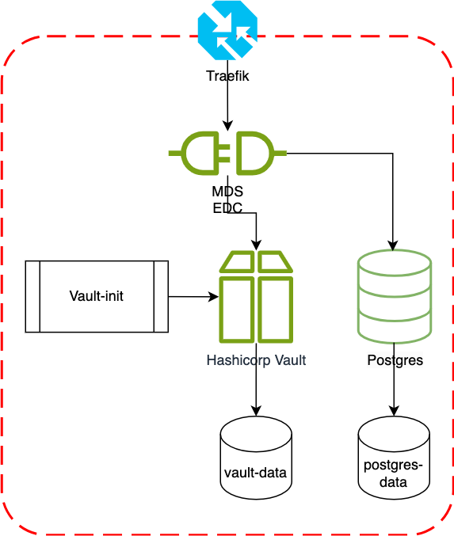

# MDS Connector

This is the open source EDC distribution of the MDS Connector.

## Quick start

### Build MDS EDC Java Runtimes

Build project
```
./gradlew build
```

### Build MDS EDC Docker Images

Build docker image

#### In Memory connector

```
docker build --build-arg RUNTIME="connector-inmemory" launchers
```

#### Vault PostgreSQL connector
### Vault PostgreSQL connector
```
docker build --build-arg RUNTIME="connector-vault-postresql" launchers
docker build --build-arg RUNTIME="connector-vault-postgresql" launchers
```

## Directory structure

* extensions: this is where your extension modules should be implemented
* launchers: contains executable modules for the MDS connector
* tests: contains e2e tests of MDS connector features.
* docs: contains documentation for users and contributors regarding the different features of MDS connector and deployments guides.

## Deploy the Blueprint MDS EDC Participant Infrastructure with `docker-compose`

### Prerequisites

- Docker and Docker Compose installed on your system
- A domain name (for production use with Let's Encrypt SSL)

### Architecture



The deployment architecture consists of the following components:

1. Traefik: Acts as a reverse proxy and handles SSL/TLS termination. It routes incoming requests to the appropriate services and manages Let's Encrypt certificates for HTTPS.

2. MDS EDC: The core component of the MDS (Mobility Data Space) Connector. It handles data exchange, policy enforcement, and integration with other participants in the dataspace.

3. PostgreSQL: Provides persistent storage for the EDC, storing configuration data, policies, and other necessary information.

4. Vault: HashiCorp Vault is used for secure secret management. It stores sensitive information such as API keys, certificates, and passwords, which are then injected into the EDC service.

5. Vault-init: A helper service that initializes and configures the Vault with necessary secrets during deployment.

This architecture ensures a secure, scalable, and maintainable deployment of the MDS Connector. Traefik handles incoming traffic and SSL, the EDC processes data requests and enforces policies, PostgreSQL provides persistent storage, and Vault manages secrets securely.

### Configuration

1. An `.env.example` file is provided in the project root. This file contains a template for all the necessary environment variables, grouped by their respective components (MDS EDC, DAPS, Postgres, and Vault).

2. Create a `.env` file by copying the `.env.example` file:
   ```
   cp .env.example .env
   ```

3. Edit the `.env` file and replace the placeholder values with your actual configuration. The variables are as follows:

   ```
   # MDS EDC Configuration
   EDC_HOSTNAME=your-domain.com
   EDC_PARTICIPANT_ID=your-participant-id
   ACME_EMAIL=your@email.com

   # DAPS (Dynamic Attribute Provisioning Service) Configuration
   DAPS_URL=https://daps.demo.mobility-dataspace.eu/realms/DAPS/protocol/openid-connect
   EDC_OAUTH_CLIENT_ID=your-oauth-client-id
   P12_PASSWORD=your-p12-password
   P12_CONTENT=your-p12-content-base64-encoded

   # Postgres Configuration
   POSTGRES_USER=edc
   POSTGRES_PASSWORD=your-secure-password

   # Vault Configuration
   VAULT_TOKEN=your-vault-token
   VAULT_HOSTNAME=vault.localhost
   ```

   Ensure you replace all placeholder values with your actual configuration details.

   To generate the P12_CONTENT for your .env file:

    1. Locate your p12 file (e.g., `mds-connector-certificate.p12`).

    2. Use the base64 command to encode the p12 file:
       ```
       base64 -i mds-connector-certificate.p12
       ```
    3. Copy the output (a long string of characters).
    4. In your .env file, paste the encoded content as the value for P12_CONTENT:
   ```
   P12_CONTENT="[Paste your base64 encoded string here]"
   ```
    5. Make sure to enclose the entire string in quotes.

   Note: The P12_CONTENT is a required variable in your .env file. It contains the base64 encoded content of your p12 certificate file.

4. (Optional) For testing with self-signed certificates, modify the `traefik` service in `docker-compose.yml`:
   ```yaml
   traefik:
     # ... other configurations ...
     command:
       # ... other commands ...
       - "--certificatesresolvers.myresolver.acme.caserver=https://acme-staging-v02.api.letsencrypt.org/directory"
   ```

   This uses Let's Encrypt's staging server for testing. Remove this line for production use.

### Deployment Steps

1. Ensure the `init-vault.sh` script is in the same directory as your `docker-compose.yml` file.

2. Make the script executable:
   ```
   chmod +x init-vault.sh
   ```

3. Start the services:
   ```
   docker compose up -d
   ```

   This will start all services, including the automated Vault initialization.

4. Verify that all services are running:
   ```
   docker compose ps
   ```

5. The services should now be running:
    - EDC: https://your-domain.com
    - Vault: https://vault.your-domain.com
    - Traefik Dashboard: http://your-domain.com:8080 (if enabled)

### Usage

- API: https://your-domain.com/api
- Control: https://your-domain.com/control
- Management: https://your-domain.com/management
- Protocol: https://your-domain.com/protocol
- Public: https://your-domain.com/public
- Version: https://your-domain.com/version

### Security Notes

- All external access is enforced over HTTPS using Let's Encrypt SSL certificates.
- Secrets are securely stored in HashiCorp Vault and injected into the EDC service.
- The EDC service uses PostgreSQL for persistent storage.
- Traefik is configured to automatically handle SSL/TLS certificates.

### Troubleshooting

- Check container logs: `docker-compose logs [service-name]`
- Ensure all environment variables are correctly set in the `.env` file
- Verify that your domain is pointing to the correct IP address
- If you need to reinitialize the Vault or add more secrets, modify the `init-vault.sh` script and run:
  ```
  docker compose up -d --no-deps vault-init
  ```

For more detailed information on EDC configuration and usage, refer to the official Eclipse Dataspace Connector documentation.
