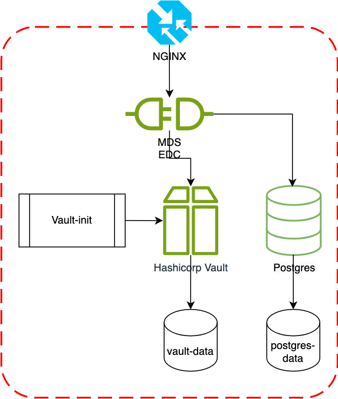

## Deploy the Blueprint MDS EDC Participant Infrastructure with `docker-compose`

### Prerequisites

- Docker and Docker Compose installed on your system
- A domain name (for production use with Let's Encrypt SSL)

### Architecture



The deployment architecture consists of the following components:

1. Nginx: Acts as a reverse proxy and handles SSL/TLS termination. It routes incoming requests to the appropriate services.

2. Certbot: Manages SSL/TLS certificates using Let's Encrypt for HTTPS.

3. MDS EDC: The core component of the MDS (Mobility Data Space) Connector. It handles data exchange, policy enforcement, and integration with other participants in the dataspace.

4. PostgreSQL: Provides persistent storage for the Connector, storing configuration data, policies, and other necessary information.

5. Vault: HashiCorp Vault is used for secure secret management. It stores sensitive information such as API keys, certificates, and passwords, which are then injected into the EDC service.

6. Vault-init: A helper service that initializes and configures the Vault with necessary secrets during deployment.

### Configuration

1. An `.env.example` file is provided in the project root. This file contains a template for all the necessary environment variables, grouped by their respective components (MDS EDC, DAPS, Postgres, and Vault).

2. Create a `.env` file by copying the `.env.example` file:
   ```
   cp .env.example .env
   ```

3. Edit the `.env` file and replace the placeholder values with your actual configuration. The variables are as follows:

   ```
   # MDS EDC Configuration
   EDC_HOSTNAME=yourdomain.com
   EDC_PARTICIPANT_ID=your-participant-id
   CERTBOT_EMAIL=your@email.com

   # DAPS (Dynamic Attribute Provisioning Service) Configuration
   DAPS_URL=https://daps.demo.mobility-dataspace.eu/realms/DAPS/protocol/openid-connect
   EDC_OAUTH_CLIENT_ID=your-oauth-client-id
   P12_PASSWORD=your-p12-password
   P12_FILE_PATH=your-p12-file-path

   # Postgres Configuration
   POSTGRES_USER=edc
   POSTGRES_PASSWORD=your-secure-password

   # Vault Configuration
   VAULT_TOKEN=your-vault-token
   
   # Logging House Configuration
   LOGGING_HOUSE_URL=your-lh-url
   ```

   Ensure you replace all placeholder values with your actual configuration details.

4. Update the Nginx configuration files:
   - Edit `init.nginx.conf` and `secure.nginx.conf` to match your domain and desired server configuration.
   - In both files, replace `yourdomain.com` with your actual domain name.
   - Adjust any other settings as needed for your specific deployment.

   To generate the P12_CONTENT for your .env file:

    1. Locate your p12 file (e.g., `mds-connector-certificate.p12`).

    2. Use the base64 command to encode the p12 file:
       ```
       base64 -i mds-connector-certificate.p12
       ```
    3. Copy the output (a long string of characters).
    4. In your .env file, paste the encoded content as the value for P12_CONTENT:
   ```
   P12_CONTENT="[Paste your base64 encoded string here]"
   ```
    5. Make sure to enclose the entire string in quotes.

   Note: The P12_CONTENT is a required variable in your .env file. It contains the base64 encoded content of your p12 certificate file.

### Deployment Steps

1. Ensure the `init-vault.sh` and `init-letsencrypt.sh` scripts are in the same directory as your `docker-compose.yml` file.

2. Make the scripts executable:
   ```
   chmod +x init-vault.sh init-letsencrypt.sh
   ```

3. Update your `docker-compose.yml` file to use the initial Nginx configuration:
   ```yaml
   nginx:
     ...
     volumes:
       - ./init.nginx.conf:/etc/nginx/nginx.conf
   ```

4. Initialize SSL certificates:
   ```
   ./init-letsencrypt.sh
   ```
   This script will start the Nginx service with the initial configuration and set up SSL certificates using Let's Encrypt. It will prompt you to confirm before replacing any existing certificates.

5. After successfully obtaining the certificates, update your `docker-compose.yml` file to use the secure Nginx configuration:
   ```yaml
   nginx:
     ...
     volumes:
       - ./secure.nginx.conf:/etc/nginx/nginx.conf
   ```

6. Start all services with the secure configuration:
   ```
   docker compose up -d
   ```
   This will start all services, including the automated Vault initialization, and Nginx with SSL/TLS enabled.

7. Verify that all services are running:
   ```
   docker compose ps
   ```

### Usage

The EDC services are now available at the following URLs:

- API: https://yourdomain.com/api
- Management: https://yourdomain.com/api/management
- Protocol: https://yourdomain.com/api/dsp
- Public: https://yourdomain.com/public

Replace `yourdomain.com` with the actual domain you've configured in your `.env` file.

> In a production environment, The only endpoints that should exposed on the internet are the protocol and the public endpoints. 
> The other endpoints are meant to be used internally within the participant network. For example, the Control API is meant to be used for internal component interactions. Read the [EDC documentation](https://eclipse-edc.github.io/documentation/for-contributors/best-practices/#21-exposing-apis-to-the-internet) for more details

### Security Notes

- All external access is enforced over HTTPS using Let's Encrypt SSL certificates.
- Secrets are securely stored in HashiCorp Vault and injected into the EDC service.
- The EDC service uses PostgreSQL for persistent storage.
- Nginx is configured to handle SSL/TLS termination and reverse proxy to the EDC services.

### Troubleshooting

- Check container logs: `docker compose logs [service-name]`
- Ensure all environment variables are correctly set in the `.env` file
- Verify that your domain is pointing to the correct IP address
- If you need to reinitialize the Vault or add more secrets, modify the `init-vault.sh` script and run:
  ```
  docker compose up -d --no-deps vault-init
  ```
- If you need to renew SSL certificates, you can re-run the `init-letsencrypt.sh` script:
  ```
  ./init-letsencrypt.sh
  ```

For more detailed information on EDC configuration and usage, refer to the official Eclipse Dataspace Connector documentation.